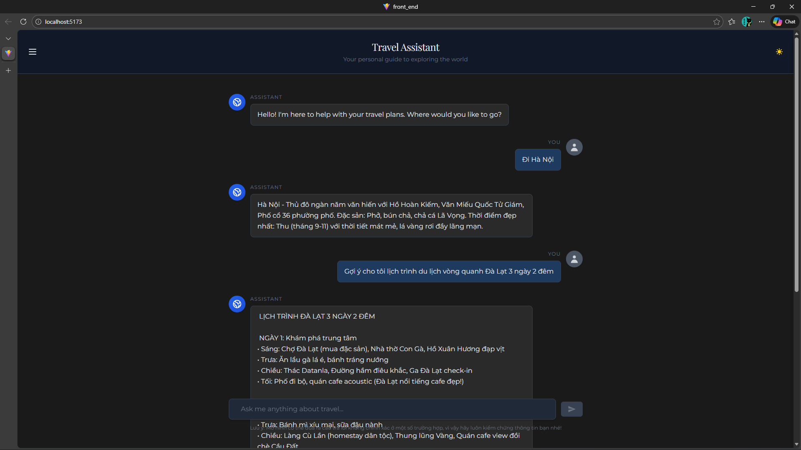
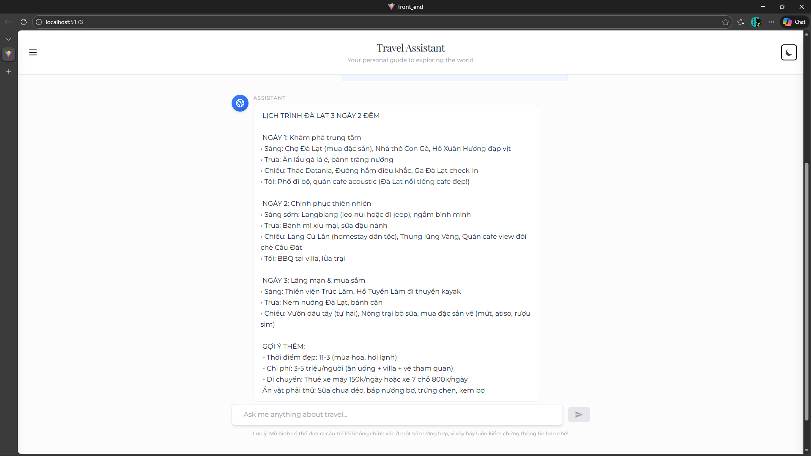
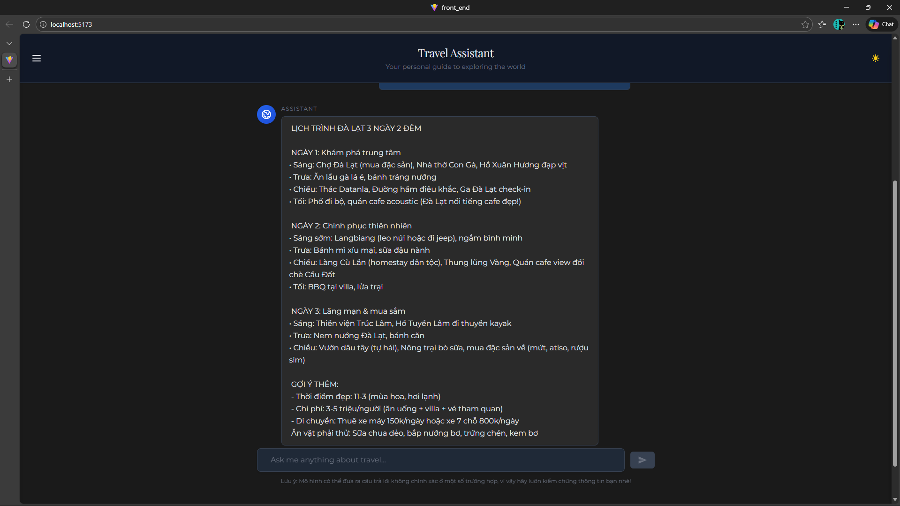
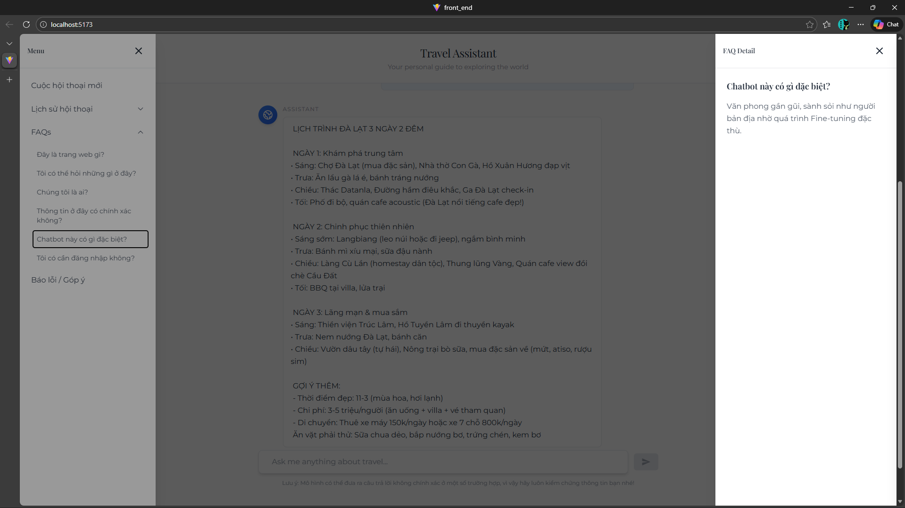
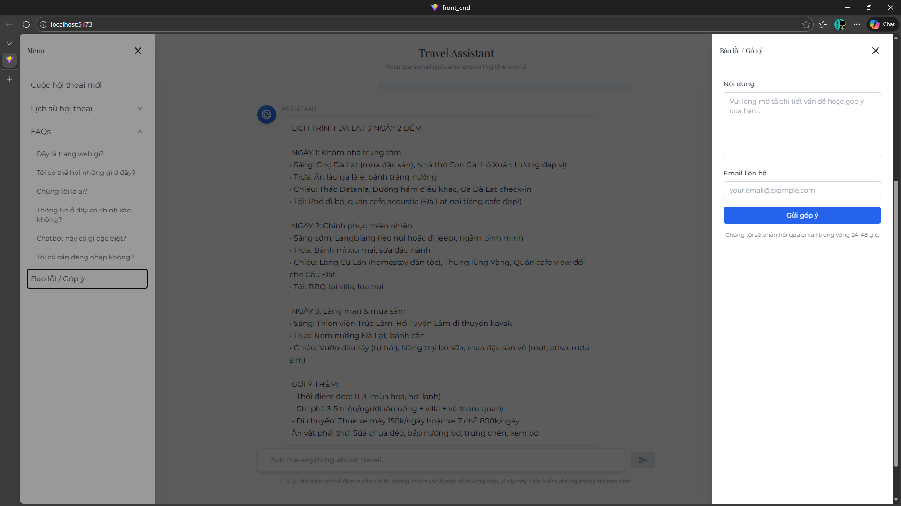

# Travel Chatbot - Vietnam Tourism Assistant
A React Front-end for Travel RAG Chatbot

Features:
+ AI Chat for 18 provinces in Vietnam (travel, cuisine, itinerary)
+ Chat history management (Sessions)
+ Dark/Light mode
+ Default responses for destinations and itineraries

UI Demo:











---
Demo Video (**front_end_demo.mp4**) at:

https://github.com/acesmile123/RAG_travel_chatbot/tree/main/front_end/assets
---

Setup:

**Requirements:**
- Node.js 18+ ([Download here](https://nodejs.org))
- Git ([Download here](https://git-scm.com))

**Installation Steps:**

1. Clone the repository:
```bash
git clone https://github.com/acesmile123/RAG_travel_chatbot.git
cd RAG_travel_chatbot/front_end
```

2. Install dependencies:
```bash
npm install
```

3. Create `.env` file in `front_end/` folder:
```
VITE_API_BASE=http://localhost:8000
```

4. Run the application:
```bash
npm run dev
```

5. Open your browser and visit: `http://localhost:5173`
